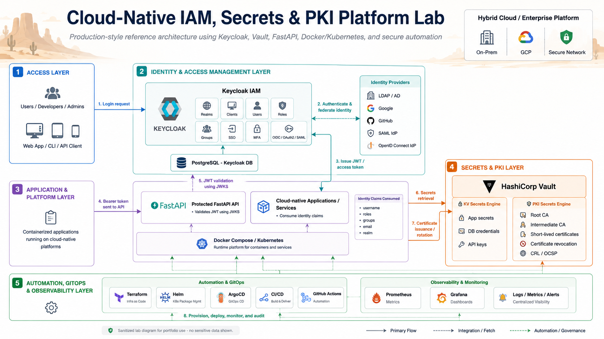

# Keycloak Vault PKI Platform Lab

Cloud-native IAM, secrets management, and PKI platform lab using Keycloak, HashiCorp Vault, FastAPI, Docker Compose, OIDC, JWT validation, and certificate lifecycle automation.

This project is built as a hands-on engineering lab to demonstrate IAM, Keycloak, Vault, PKI, DevSecOps, and secure platform engineering skills.

## Architecture Overview

This diagram shows the production-style flow of the lab, including Keycloak IAM, identity providers, OIDC/JWT authentication, protected APIs, HashiCorp Vault secrets management, Vault PKI certificate lifecycle, automation, GitOps, and observability.

## What This Project Demonstrates

- Keycloak-based IAM setup
- Realm, client, user, and role configuration
- OIDC access token generation
- JWT validation using Keycloak JWKS
- Protected API integration using FastAPI
- HashiCorp Vault KV secrets engine
- Vault PKI secrets engine
- Internal root CA generation
- Short-lived certificate issuance
- Certificate revocation
- CRL endpoint evidence
- Secure handling of sensitive evidence before publishing to GitHub

## Services and Ports

| Service | Local URL |
|---|---|
| Keycloak | http://localhost:8180 |
| Vault | http://localhost:8200 |
| FastAPI Backend | http://localhost:8100 |
| FastAPI Docs | http://localhost:8100/docs |
| PostgreSQL | localhost:5433 |

## Local Credentials

This is a local lab only. Do not use these credentials in production.

| Service | Username | Password / Token |
|---|---|---|
| Keycloak Admin | admin | admin |
| Keycloak Test User | amin | Password123! |
| Vault Root Token | root | root |

## Start the Lab

Run:

docker compose up -d --build

Check containers:

docker compose ps

## Configure Keycloak

Run:

bash keycloak/scripts/init-keycloak.sh

This creates:

- Realm: iam-lab
- Client: iam-lab-cli
- User: amin
- Role: platform-engineer

## Get an OIDC Token

Run:

TOKEN=$(bash keycloak/scripts/get-token.sh)
echo "$TOKEN"

## Test the Protected API

Run:

curl -H "Authorization: Bearer $TOKEN" http://localhost:8100/protected | python3 -m json.tool

## Configure Vault Secrets and PKI

Run:

bash vault/scripts/init-vault-pki.sh

This configures:

- KV v2 secrets engine
- Demo backend application secret
- PKI secrets engine
- Internal root CA
- PKI role for iam-lab.local
- Short-lived certificate issuance
- Certificate revocation
- CRL evidence

## Evidence

Clean evidence summaries are stored in:

- evidence/keycloak-oidc-summary.md
- evidence/vault-pki-summary.md

Raw Vault files such as certificates, private keys, JSON outputs, CRL files, and secret evidence are ignored using .gitignore and should not be committed.

## Skills Demonstrated

- IAM engineering
- Keycloak administration basics
- OIDC authentication flow
- OAuth2 token flow
- JWT validation
- JWKS verification
- User and role management
- HashiCorp Vault secrets management
- Vault PKI certificate lifecycle
- Certificate issuance and revocation
- CRL lifecycle evidence
- Docker Compose-based local platform setup
- Secure DevSecOps documentation

## Production Mapping

This lab runs locally using Docker Compose, but the architecture maps to real enterprise platform patterns:

| Lab Component | Production Equivalent |
|---|---|
| Docker Compose | Kubernetes, OpenShift, or GKE |
| Keycloak single node | Keycloak HA deployment with external database |
| PostgreSQL container | Managed PostgreSQL or HA database cluster |
| Vault dev mode | Vault HA with Raft storage and KMS/HSM auto-unseal |
| Local OIDC client | Enterprise application client integration |
| Demo user and role | Federated users, groups, RBAC and ABAC policies |
| Vault KV secret | Application secrets and dynamic credentials |
| Vault PKI root CA | Internal CA, intermediate CA and certificate lifecycle |
| Local scripts | Terraform, Helm, ArgoCD and CI/CD automation |

The project is intentionally sanitized for public GitHub use. Raw secrets, private keys, certificates, Vault JSON outputs and CRL files are excluded from version control.

## Roadmap

Planned improvements:

- Add Terraform automation for Keycloak realm, client, users and roles
- Add Terraform automation for Vault KV, policies and PKI roles
- Add Kubernetes deployment using kind or minikube
- Add Helm values for Keycloak, Vault and the protected API
- Add ArgoCD GitOps application manifests
- Add Prometheus and Grafana observability dashboards
- Add CI validation for Docker Compose, shell scripts and security scanning
- Add architecture decision records for IAM, Vault and PKI design choices

## Terraform Automation

This project includes Terraform examples for managing Keycloak and Vault configuration as code.

Terraform automation covers:

- Keycloak realm creation
- Keycloak OIDC client configuration
- Keycloak realm roles
- Vault KV v2 secrets engine
- Vault PKI secrets engine
- Vault internal root CA
- Vault PKI role for certificate issuance

Terraform folders:

- terraform/keycloak
- terraform/vault

Clean Terraform evidence summary:

- evidence/terraform-automation-summary.md

Terraform state files and provider cache folders are excluded from Git using `.gitignore`.

## Kubernetes and Helm

This project includes a Helm chart for deploying the protected FastAPI API to Kubernetes.

Kubernetes and Helm coverage:

- kind local Kubernetes cluster
- Helm chart for platform API
- Kubernetes Deployment and NodePort Service
- Access without kubectl port-forward using kind port mapping
- Readiness and liveness probes
- Resource requests and limits
- JWT validation from a Kubernetes-hosted workload
- Production mapping for GKE, OpenShift and enterprise Kubernetes

Documentation:

- docs/kubernetes/kubernetes-helm.md

Clean evidence summary:

- evidence/kubernetes-helm-summary.md

## ArgoCD GitOps

This project includes ArgoCD GitOps deployment for the protected FastAPI API.

GitOps coverage:

- ArgoCD installed inside Kubernetes
- GitHub repository used as source of truth
- Helm chart deployed through ArgoCD
- Automated sync enabled
- Prune and self-heal enabled
- ArgoCD UI exposed without kubectl port-forward using kind port mapping
- Platform API exposed without kubectl port-forward using NodePort
- Application reached Synced and Healthy state

Documentation:

- docs/gitops/argocd-gitops.md

Clean evidence summary:

- evidence/argocd-gitops-summary.md

## Kubernetes Security Hardening

The platform API workload includes production-style Kubernetes security hardening.

Hardening controls:

- Non-root container execution
- Fixed runtime user and group
- Read-only root filesystem
- Privilege escalation disabled
- Linux capabilities dropped
- RuntimeDefault seccomp profile
- GitOps-managed rollout through ArgoCD

Clean evidence summary:

- evidence/kubernetes-security-hardening-summary.md
